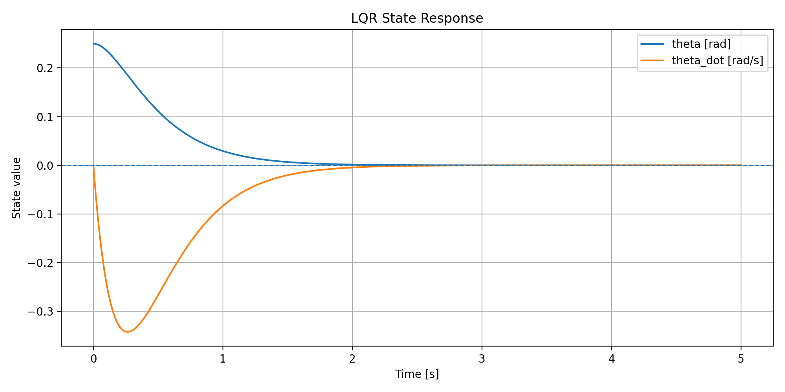
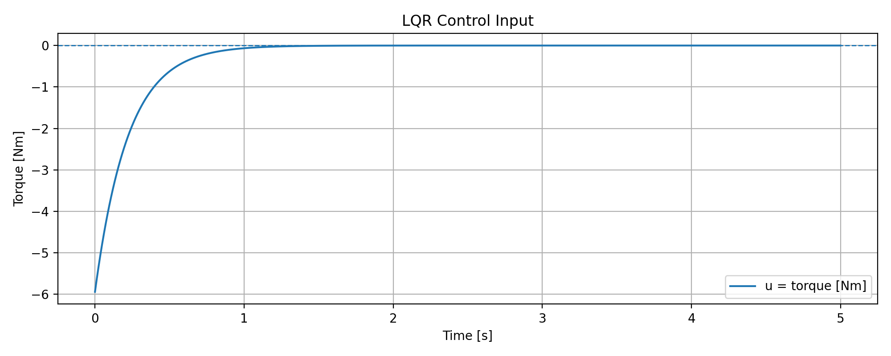
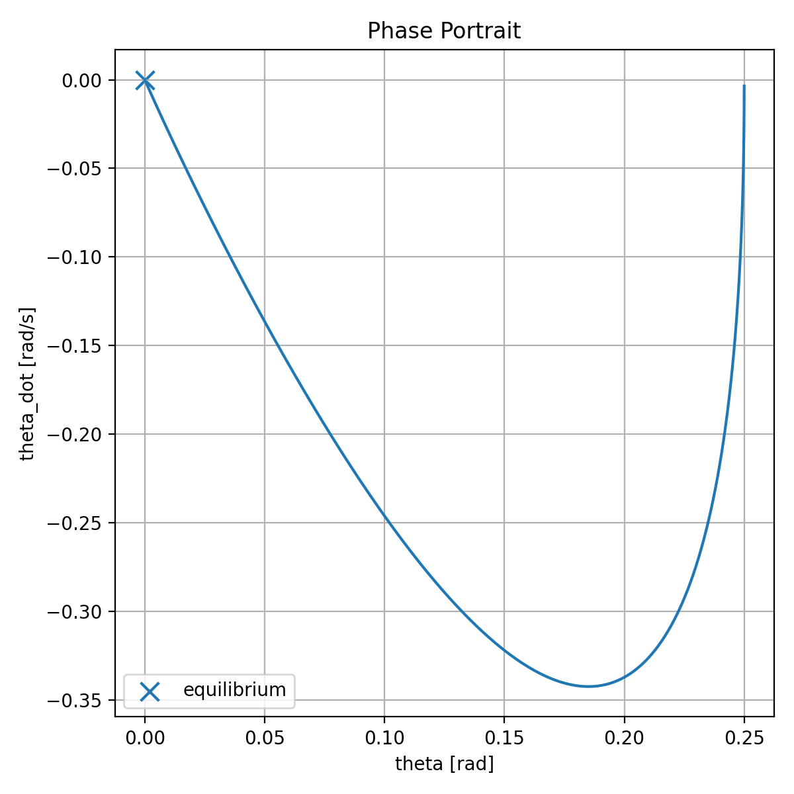

# OptimalControl

### Discrete-Time LQR Control of a Nonlinear Inverted Pendulum (C++ / Eigen)

This repository demonstrates **optimal state-feedback stabilization** of a nonlinear inverted pendulum using a **discrete-time Linear Quadratic Regulator (LQR)** controller.

The project includes:

- nonlinear pendulum dynamics
- continuous-to-discrete system conversion
- discrete Riccati equation solver
- RK4 numerical integration
- closed-loop simulation
- CSV logging and visualization tools

The implementation is written in **modern C++ (C++17)** using **Eigen** and built with **CMake**.

---

# Mathematical Formulation

The nonlinear pendulum dynamics are:

```text
θ̈ = (g / l) sin(θ) + (1 / (m l²)) τ
```

State vector:

```text
x = [ θ
      θ̇ ]
```

Linearized state-space model around the upright equilibrium:

```text
ẋ = A x + B u
```

where:

```text
A = [ 0    1
      g/l  0 ]
```

```text
B = [     0
      1/(m l²) ]
```

The discrete-time LQR controller computes:

```text
uₖ = -K xₖ
```

by minimizing the quadratic cost:

```text
J = Σ (xₖᵀQxₖ + uₖᵀRuₖ)
```

where:

- `Q` penalizes state error
- `R` penalizes control effort
---

# Repository Structure

```text
OptimalControl/
│
├── include/
│   ├── InvertedPendulum.hpp
│   └── LQR.hpp
│
├── src/
│   ├── InvertedPendulum.cpp
│   ├── LQR.cpp
│   └── main.cpp
│
├── scripts/
│   ├── plot_results.py
│   └── requirements.txt
│
├── data/
│   ├── simulation.csv
│   ├── state_response.png
│   └── control_input.png
│
├── CMakeLists.txt
├── README.md
└── LICENSE
```

---

# Build

```bash
mkdir build
cd build
cmake ..
make -j4
```

---

# Run Simulation

```bash
./lqr_pendulum
```

This generates:

```text
data/simulation.csv
```

containing:

- pendulum angle
- angular velocity
- control torque

---

# Visualization

Install Python dependencies:

```bash
cd scripts
pip install -r requirements.txt
```

Generate plots:

```bash
python plot_results.py
```

---

# Results

## 🔹 State Response (`data/state_response.png`)

This figure shows the closed-loop stabilization of the inverted pendulum.
Both the pendulum angle and angular velocity converge smoothly toward zero,
demonstrating stable LQR feedback control.

<p align="center">
  
</p>

---

## 🔹 Control Input (`data/control_input.png`)

This figure shows the control torque generated by the LQR controller.
Initially, a larger corrective torque is applied to stabilize the pendulum,
after which the control effort smoothly converges toward zero.

<p align="center">
  
</p>

---

## 🔹 Phase Portrait (`data/phase_portrait.png`)

This phase portrait visualizes the pendulum trajectory in state-space
(angle vs angular velocity). The closed-loop LQR controller drives the
system toward the stable equilibrium at the origin while dissipating
system energy through feedback damping.

<p align="center">
  
</p>

---

# Numerical Integration

The simulation uses:

## RK4 (Runge–Kutta 4th Order)

instead of simple Euler integration for improved numerical stability and simulation accuracy.

---

# Dependencies

## C++

- C++17
- Eigen3
- CMake ≥ 3.10

## Python

```text
numpy
pandas
matplotlib
```

---

# License

MIT License — free for academic and commercial use.
